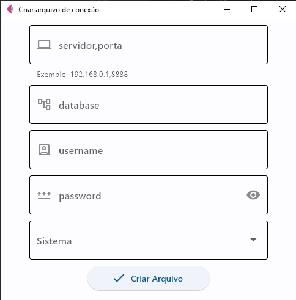

# Consulta-Contribuintes
Script para efetuar download de csv contendo informações de situação cadastral dos contribuintes de Alagoas

Ao executar o script main.py o sistema abre o google chrome em segundo plano, acessa o site da sefaz da Bahia e faz a pesquisa por contribuintes de Alagoas, ao concluir a pesquisa é feita requisição de download dessa planilha, a mesma é salva em uma pasta de destino junto com a data o qual foi baixada, ao executar o script no dia posterior são feitos os mesmos procedimentos e dessa vez compara os dois arquivos, do dia anterior com o dia atual e gera um novo arquivo mostrando apenas as diferenças entre eles, fazendo com que se tenha bem menos dados para se trabalhar. Foi adicionado o arquivo banco onde faz conexão com o banco de dados da empresa e de acordo com as alterações já consulta se algum dos clientes faz parte do cadastro da empresa.

Site utilizado - http://nfe.sefaz.ba.gov.br/servicos/nfenc/Modulos/Geral/NFENC_consulta_cadastro_ccc.aspx

## Conexão com banco de dados
A conexão com o banco de dados se da através do arquivo banco.py, o mesmo utiliza a biblioteca pyodbc para conexão e consulta, a mesma precisa dos parametros de conexão: Servidor, Porta, Banco de dados, Usuário e Senha.
Havendo essa necessidade foi criado o programa cria_config.py onde o mesmo solicita essas informações e cria um arquivo criptografado a partir da chave disponibilizada no inicio do código, essa mesma chave deve ser utilizada no arquivo banco.py para descriptografar as informações, vide interface da aplicação.

## Video
[Video](https://youtu.be/oGeQqE0XEdw)